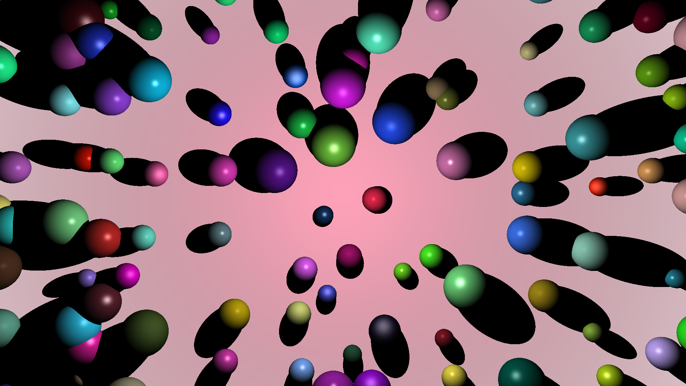
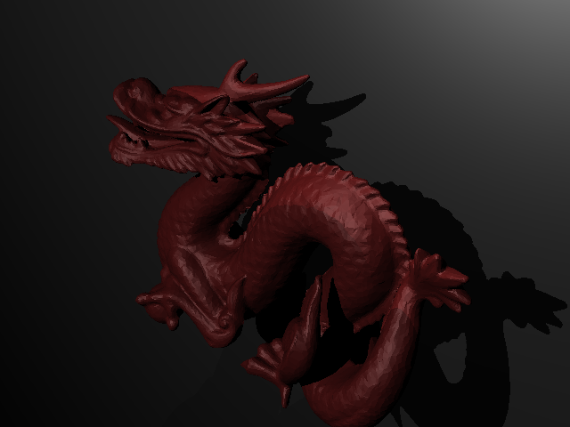

<h1><strong>RayTracer</strong> Java pour le cours de Conception Orientée Objet</h1>
<h2><i>Adam Darrot - Noam Labrousse</i></h2> <!-- Slightly smaller and italicized for subtle emphasis -->
 
 
<h2>Usage</h2>
<h3>$ java -jar raytracer.jar [options | scene]<h3>

<h3>Scene</h3>

Chemin relatif du fichier de scène à utiliser

 
<h3>Options :<h3> 
<ul>
    <li>
        <h4>--all</h4>
        
Genere les images de toutes les fichiers .scene et .test présentes dans le répertoire TestScenes. Il est nécessaire de se trouver dans le répertoire racine du repo

    </li>
    <li>
        <h4>--compare image1 image2</h4>
        
Compare les deux images, donne le nombre de pixels différents et créee une image différencielle imageDiff.png

    </li>
</ul>
 
 
<h2>Build :</h2>
<h3>$ mvn package</h3>
<h5>Le .jar se trouvera dans target/</h5>
 
 
<h2>Images Générées</h2>

